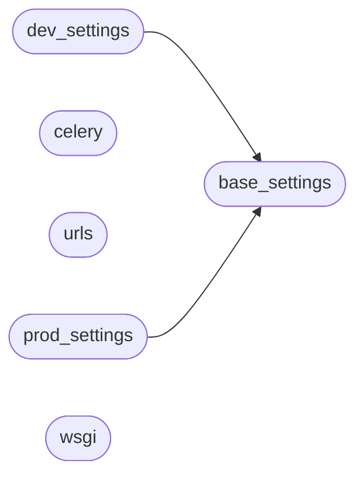

# Code Overview

[_Documentation generated by Documatic_](https://www.documatic.com)

<!---Documatic-section-Codebase Structure Python-start--->
## Codebase Structure Python

The codebase has a flat structure, with 7 code files.

<!---Documatic-block-system_architecture-start--->

<!---Documatic-block-system_architecture-end--->

# #
<!---Documatic-section-Codebase Structure Python-end--->

<!---Documatic-section-Important Functions-start--->
## Important Functions

<!---Documatic-block-important_funcs-start--->
<!---Documatic-block-most_used_funcs-start--->
### Most Utilised Functions

* playlistor.base_settings.get_from_file_if_exists (2 times)
* playlistor.base_settings.get_secret (2 times)
<!---Documatic-block-most_used_funcs-end--->
<!---Documatic-block-important_funcs-end--->

# #
<!---Documatic-section-Important Functions-end--->

<!---Documatic-section-File IO-start--->
## File IO

<!---Documatic-block-file_io-start--->
The following files have file read operations

<!---Documatic-block-playlistor-start--->

	
<code>playlistor</code> (Click to Expand!)

* playlistor.base_settings

<!---Documatic-block-playlistor-end--->
<!---Documatic-block-file_io-end--->

# #
<!---Documatic-section-File IO-end--->

[_Documentation generated by Documatic_](https://www.documatic.com)